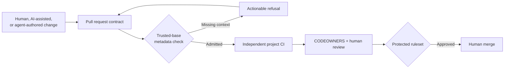

# Helicopter

Governance and intake for open source projects working with human, AI-assisted, and agent-authored contributions.

[](https://github.com/thekidnamedkd/helicopter/actions/workflows/contribution-policy-tests.yml)
[](LICENSE)

AI can produce patches faster than maintainers can review them. More output does not mean more correct, useful, or trustworthy work. A generated change can pass syntax checks while missing the product intent, weakening a security boundary, or shifting review cost onto volunteers.

Helicopter gives maintainers a clear view of ownership, provenance, risk, and queue pressure before they spend time on a patch. It keeps one person accountable for every contribution, rejects incomplete submissions early, and leaves merge authority with humans.

## The problem

Most contribution processes assume a person performed the work and can explain it. Agentic workflows break that assumption:

- one operator can open many plausible pull requests;
- automated evidence may describe checks that were never run independently;
- agents can cross repository, network, secret, or tool boundaries;
- prompt injection and dependency substitution can target reviewers and CI; and
- maintainers still carry the cost of understanding, correcting, and supporting the result.

Projects need better intake without building an agent platform or turning every contribution into a compliance exercise.

## What Helicopter does

Helicopter adds a small policy layer to the normal GitHub pull request flow:

1. The contributor names an accountable human and declares how the work was produced.
2. Agent-authored work includes identity, run, base commit, and capability metadata.
3. A metadata-only workflow runs the validator from the protected base commit.
4. CODEOWNERS, project CI, rulesets, and human review handle the actual change.
5. Maintainers get one actionable refusal path when required context is missing.



The validator checks whether declarations are present and internally consistent. It does not decide whether a patch is correct or whether a claim is true.

## Who it considers

- **Maintainers:** bounded queues, early refusals, protected policy files, and less review spent on incomplete work.
- **Contributors:** one visible contract, specific repair instructions, and the same behavioral standard regardless of tool choice.
- **Security owners:** no untrusted code in privileged intake, minimum token permissions, immutable action pins, and explicit capability disclosure.
- **Small projects:** plain Markdown, GitHub-native controls, a dependency-free validator, and no service to operate.

Helicopter moderates behavior and evidence. It does not ask maintainers to guess whether prose “looks AI-generated.”

## What is included

- `CONTRIBUTING.md`: Helicopter's contribution contract for humans and agents.
- `.github/pull_request_template.md`: accountable owner, verification, risk, and agent provenance.
- `.github/workflows/contribution-intake.yml`: trusted-base metadata admission.
- `scripts/validate_pr.py`: dependency-free validation with actionable refusal codes.
- `.github/CODEOWNERS` and `MAINTAINERS.md`: ownership and repository settings.
- `SECURITY.md`, `CODE_OF_CONDUCT.md`, and focused issue forms.

Add an agent framework, AI reviewer, provenance database, transcript storage, or policy DSL only when a real workflow needs it.

## Before you start

Both setup paths need:

- [Git](https://git-scm.com/downloads);
- Python 3.10 or newer;
- the [GitHub CLI](https://github.com/cli/cli#installation); and
- a GitHub account that can create the new repository or administer the existing one.

Install `gh` with the official package for your platform:

```sh
# macOS
brew install gh

# Windows
winget install --id GitHub.cli --source winget
```

Use the [official Linux packages](https://github.com/cli/cli/blob/trunk/docs/install_linux.md) rather than copying an old distribution-specific command.

Authenticate in a browser, then check the active account:

```sh
gh auth login --web
gh auth status
```

Repository administration matters. The files can be added with write access, but rulesets, required checks, private vulnerability reporting, interaction limits, and some security features require an administrator.

## Start a new project with an agent

Create a repository from Helicopter's template, choosing the correct owner, name, and visibility:

```sh
gh repo create OWNER/PROJECT \
  --template thekidnamedkd/helicopter \
  --private \
  --clone
cd PROJECT
```

Use `--public` instead of `--private` when the repository should be public. Then open the new directory in your coding agent and paste:

```text
Set up this new repository using Helicopter as its contribution and
governance layer.

Project:
- Name: <PROJECT_NAME>
- Purpose: <ONE_SENTENCE_PURPOSE>
- Primary language/runtime: <STACK>
- GitHub owner: <OWNER>
- Maintainer or team: <CODEOWNER>
- Security contact: <PRIVATE_CONTACT_OR_GITHUB_REPORTING_ROUTE>
- Contribution agreement: <DCO_OR_CLA>
- Repository visibility: <PUBLIC_OR_PRIVATE>

Read README.md, CONTRIBUTING.md, MAINTAINERS.md, SECURITY.md,
CODE_OF_CONDUCT.md, .github/, scripts/validate_pr.py, and its tests before
editing. Keep Helicopter's accountable-human model, trusted-base metadata
workflow, least-privilege permissions, and human-only merge authority.

Adapt every Helicopter-specific name, URL, owner, contact, issue label, and
contribution term to this project. Add the project's real build and test CI
in a separate pull_request workflow. Do not check out or execute contributor
code in the pull_request_target workflow. Add dependency manifests,
lockfiles, release paths, security-sensitive code, generators, and agent
instructions to CODEOWNERS where they exist.

Run the validator tests and the project's own checks. Report the file changes,
test results, and GitHub settings that still require an administrator. Do not
claim that metadata validation proves a contribution is correct.
```

The prompt leaves product architecture to the agent and uses Helicopter only for contribution governance.

## Add Helicopter to an existing repository

Start from a clean working tree and confirm that `gh` points at the intended repository:

```sh
git status --short
gh repo view
gh auth status
```

Open the repository in your coding agent and paste:

```text
Integrate Helicopter from https://github.com/thekidnamedkd/helicopter into
this existing repository.

Audit the repository before editing. Preserve stronger existing contribution,
security, conduct, ownership, and CI controls. Merge Helicopter's useful parts
into existing files instead of overwriting them or creating a second policy.

Identify the repository's maintainers, contribution agreement, private
security route, issue labels, required checks, dependency and lock files,
release paths, security-sensitive code, generators, and agent instructions.
Adapt Helicopter's templates, CODEOWNERS entries, metadata validator, and
workflows to those facts. Keep privileged intake metadata-only and run
untrusted builds in a separate pull_request workflow without secrets.

Run python3 tests/test_validate_pr.py plus the repository's existing checks.
Show the final diff, test results, assumptions, and any GitHub settings an
administrator must finish. Do not commit or push until the integration has
been reviewed.
```

After either flow:

1. Run `python3 tests/test_validate_pr.py`.
2. Complete the settings in `MAINTAINERS.md`.
3. Create the issue labels referenced by the forms.
4. Open one valid and one deliberately invalid draft pull request.
5. Require `contribution-intake / validate-metadata` only after both paths behave as expected.

The default budget is two non-draft pull requests for contributors without write access. Treat that as a starting point and tune it from maintainer load and false refusals.

## Trust boundary

`contribution-intake.yml` uses `pull_request_target` only to read event metadata. It checks out the pull request's base SHA, never the contributor head, grants only `contents: read`, persists no credentials, and executes no contributor code. A head checkout, build, test, or PR-controlled action does not belong in that workflow.

Project tests belong in a separate `pull_request` workflow on an ephemeral hosted runner with no secrets and minimum token permissions.

## Limits

Helicopter cannot prove that:

- the named person reviewed or understands the patch;
- an agent's capability or provenance claims are truthful;
- the base SHA was protected when the run started;
- the contribution is correct, safe, licensed, useful, or in scope;
- a bot identity is authorized; or
- maintainers have capacity to review the work.

Rulesets, CODEOWNERS, independent CI, dependency and security checks, and human review remain the enforcement boundary.

## Contributing

Read [CONTRIBUTING.md](CONTRIBUTING.md) before opening an issue or pull request. Every contribution needs an accountable human who can explain the change and respond to review.

## Security

Do not open public issues for vulnerabilities. Follow the private reporting instructions in [SECURITY.md](SECURITY.md).

## Design principles and references

Helicopter favors controls maintainers can inspect and enforce: accountable people, least-privilege automation, protected policy, independent CI, and human merge authority. These sources informed those choices:

- [GitHub Actions secure-use guidance](https://docs.github.com/en/actions/reference/security/secure-use): minimum token permissions, immutable action SHAs, protected workflows, and no privileged execution of untrusted code.
- [GitHub rulesets](https://docs.github.com/en/repositories/configuring-branches-and-merges-in-your-repository/managing-rulesets/about-rulesets): layered merge, review, and status-check controls.
- [GitHub interaction and pull-request limits](https://docs.github.com/en/communities/moderating-comments-and-conversations/limiting-interactions-in-your-repository): platform backpressure for public repositories.
- [OpenSSF's AI coding-assistant guidance](https://best.openssf.org/Security-Focused-Guide-for-AI-Code-Assistant-Instructions): developer responsibility and normal engineering controls still apply.
- [OpenSSF's OSS-CRS review](https://openssf.org/blog/2026/04/02/from-aixcc-to-openssf-welcoming-oss-crs-to-advance-ai-driven-open-source-security/): automated validation did not establish semantic correctness for many reviewed AI patches.
- [PyTorch's AI-assisted development guidance](https://github.com/pytorch/pytorch/blob/main/CONTRIBUTING.md#ai-assisted-development): contributors own the quality of their submissions, and new contributors start from a maintainer-triaged issue.
- [LLVM's AI tool-use policy](https://github.com/llvm/llvm-project/blob/main/llvm/docs/AIToolPolicy.md): contributors remain accountable, substantial tool use is disclosed, and autonomous participation requires explicit project approval.
- [Rust's LLM usage policy](https://forge.rust-lang.org/policies/llm-usage.html): AI review is not a substitute for required human review.
- [Developer Certificate of Origin 1.1](https://developercertificate.org/): a human or organization, not a model, makes the legal certification.

## License

Helicopter is released under the [MIT License](LICENSE).
